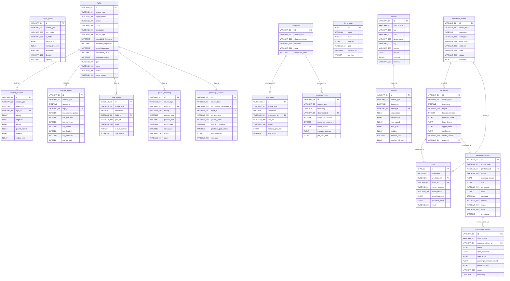

# Database ER diagram

```mermaid
erDiagram
    airport_graph {
        VARCHAR_64 id PK
        VARCHAR_20 source_type
        VARCHAR_200 from_node
        VARCHAR_200 to_node
        FLOAT distance_m
        FLOAT walking_time_min
        BOOLEAN accessible
        VARCHAR_200 direction
        INTEGER capacity
    }
    airports {
        VARCHAR_64 id PK
        VARCHAR_20 source_type
        VARCHAR_200 iata
        VARCHAR_200 icao
        VARCHAR_200 airport_name
        VARCHAR_200 city
        VARCHAR_200 country
        FLOAT latitude
        FLOAT longitude
        VARCHAR_200 timezone
    }
    checkpoint {
        VARCHAR_64 id PK
        VARCHAR_20 source_type
        VARCHAR_200 checkpoint_type
        VARCHAR_200 terminal
        VARCHAR_200 zone
        INTEGER maximum_lanes
    }
    demo_state {
        INTEGER id PK
        BOOLEAN peak
        INTEGER lanes
        FLOAT redirect
        VARCHAR_10 gate
        DATETIME updated_at
        INTEGER version
    }
    flights {
        VARCHAR_64 id PK
        VARCHAR_20 source_type
        VARCHAR_200 flight_number
        VARCHAR_200 airline
        VARCHAR_200 origin
        VARCHAR_200 destination
        VARCHAR_200 aircraft_type
        DATETIME scheduled_departure
        DATETIME estimated_departure
        DATETIME actual_departure
        DATETIME scheduled_arrival
        DATETIME estimated_arrival
        VARCHAR_200 gate
        VARCHAR_200 stand
        VARCHAR_200 status
        VARCHAR_200 delay_reason
    }
    operational_events {
        VARCHAR_64 id PK
        VARCHAR_20 source_type
        DATETIME timestamp
        VARCHAR_200 event_type
        VARCHAR_200 entity_type
        VARCHAR_200 entity_id
        VARCHAR_200 actor
        VARCHAR_200 status
        JSON metadata
    }
    aircraft_positions {
        VARCHAR_64 id PK
        VARCHAR_20 source_type
        DATETIME timestamp
        VARCHAR_64 flight_id FK
        FLOAT latitude
        FLOAT longitude
        FLOAT altitude
        FLOAT ground_speed
        FLOAT heading
        FLOAT vertical_rate
    }
    flights ||--o{ aircraft_positions : "flight_id"
    baggage_events {
        VARCHAR_64 id PK
        VARCHAR_20 source_type
        DATETIME timestamp
        VARCHAR_64 flight_id FK
        INTEGER bag_count_expected
        INTEGER bag_checked
        INTEGER bag_screened
        INTEGER bag_sorted
        INTEGER bag_loaded
        INTEGER bag_unloaded
        INTEGER bag_on_belt
    }
    flights ||--o{ baggage_events : "flight_id"
    gate_events {
        VARCHAR_64 id PK
        VARCHAR_20 source_type
        DATETIME timestamp
        VARCHAR_64 flight_id FK
        VARCHAR_200 gate_id
        VARCHAR_200 state
        INTEGER queue_estimate
        BOOLEAN gate_ready
    }
    flights ||--o{ gate_events : "flight_id"
    ground_handling {
        VARCHAR_64 id PK
        VARCHAR_20 source_type
        VARCHAR_64 flight_id FK
        VARCHAR_200 activity
        DATETIME planned_start
        DATETIME planned_end
        DATETIME actual_start
        DATETIME actual_end
        VARCHAR_200 status
        VARCHAR_200 actor
    }
    flights ||--o{ ground_handling : "flight_id"
    lane_status {
        VARCHAR_64 id PK
        VARCHAR_20 source_type
        DATETIME timestamp
        VARCHAR_64 checkpoint_id FK
        VARCHAR_200 lane_id
        VARCHAR_200 status
        FLOAT capacity_pax_min
        INTEGER staff_count
    }
    checkpoint ||--o{ lane_status : "checkpoint_id"
    passenger_flow {
        VARCHAR_64 id PK
        VARCHAR_20 source_type
        DATETIME timestamp
        VARCHAR_64 checkpoint_id FK
        INTEGER passenger_arrivals
        INTEGER passenger_departures
        INTEGER queue_length
        FLOAT average_wait_min
        FLOAT p95_wait_min
    }
    checkpoint ||--o{ passenger_flow : "checkpoint_id"
    passenger_journey {
        VARCHAR_64 id PK
        VARCHAR_20 source_type
        VARCHAR_200 anonymous_passenger_id
        VARCHAR_64 flight_id FK
        VARCHAR_200 current_node
        VARCHAR_200 journey_state
        DATETIME boarding_deadline
        DATETIME predicted_gate_arrival
        FLOAT safe_time_min
        VARCHAR_200 risk_level
    }
    flights ||--o{ passenger_journey : "flight_id"
    predictions {
        VARCHAR_64 id PK
        VARCHAR_20 source_type
        DATETIME timestamp
        VARCHAR_200 target
        INTEGER forecast_horizon
        FLOAT predicted_value
        FLOAT lower_bound
        FLOAT upper_bound
        FLOAT confidence
        VARCHAR_200 model_version
        VARCHAR_64 event_id FK
    }
    operational_events ||--o{ predictions : "event_id"
    weather {
        VARCHAR_64 id PK
        VARCHAR_20 source_type
        DATETIME timestamp
        VARCHAR_64 airport_id FK
        FLOAT temperature
        FLOAT precipitation
        FLOAT wind_speed
        FLOAT wind_gust
        FLOAT visibility
        INTEGER weather_code
        FLOAT weather_risk_score
    }
    airports ||--o{ weather : "airport_id"
    audit {
        CHAR_32 id PK
        DATETIME timestamp
        VARCHAR_64 prediction_id FK
        VARCHAR_64 event_id FK
        VARCHAR_30 human_decision
        VARCHAR_200 action_taken
        FLOAT actual_outcome
        FLOAT prediction_error
        VARCHAR_200 result
    }
    predictions ||--o{ audit : "prediction_id"
    operational_events ||--o{ audit : "event_id"
    recommendations {
        VARCHAR_64 id PK
        VARCHAR_20 source_type
        VARCHAR_64 prediction_id FK
        VARCHAR_200 action
        FLOAT expected_impact
        FLOAT cost
        VARCHAR_200 constraints
        FLOAT score
        BOOLEAN accepted
        VARCHAR_200 decision
        VARCHAR_200 reason
        VARCHAR_200 actor
        DATETIME timestamp
    }
    predictions ||--o{ recommendations : "prediction_id"
    intervention_results {
        VARCHAR_64 id PK
        VARCHAR_20 source_type
        VARCHAR_64 recommendation_id FK
        FLOAT before
        FLOAT after_predicted
        FLOAT after_actual
        FLOAT passenger_minutes_saved
        FLOAT prediction_error
        VARCHAR_200 result
        DATETIME timestamp
    }
    recommendations ||--o{ intervention_results : "recommendation_id"
```
